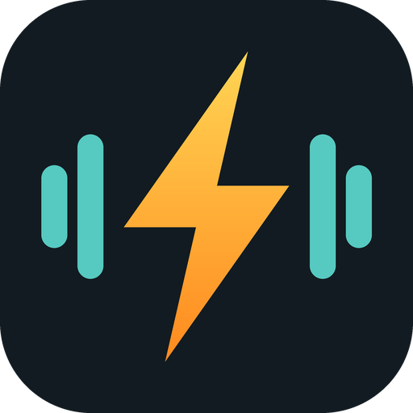

# OpenAmp

An Android app that downloads music for offline listening. Plex supplies the library, artwork and track names. A small Go file service on the home server supplies the audio files straight from the music share.

Status: phase 0 (spike). The file service is feature complete for version 1. The app signs in to Plex, lists albums, downloads an album to a folder you choose, and plays it with no connection.

## Layout

| Folder | What it is |
| --- | --- |
| `server/` | The file service: one Go binary plus ffmpeg, shipped as a Docker image |
| `android/` | The app: Kotlin, Jetpack Compose, Media3 |

## File service

The app sends a Plex track id and a quality, never a path. The service asks Plex, with the caller's token, where that track's file lives, maps the path onto its own read-only mount, and sends the file. High, Medium and Low are converted to Opus with ffmpeg and kept in a size-capped cache. A source that is already lossy at or below the chosen bitrate is sent as is.

### Run it

Copy [server/docker-compose.example.yml](server/docker-compose.example.yml) and change the three values that are specific to your server.

| Setting | Meaning | Default |
| --- | --- | --- |
| `PLEX_URL` | Address the container uses to reach Plex | required |
| `PATH_MAP` | `folder as Plex sees it=folder as the container sees it`. Several pairs are separated by commas. | required |
| `CACHE_DIR` | Where Opus copies are kept | `/cache` |
| `CACHE_MAX_MB` | Size cap of that cache | `10240` |
| `OPUS_HIGH_KBPS`, `OPUS_MEDIUM_KBPS`, `OPUS_LOW_KBPS` | Bitrates of the three lossy settings | `192`, `128`, `96` |
| `LISTEN` | Listen address | `:8080` |

To find the Plex side of `PATH_MAP`, open the music library in Plex, choose Manage Library, Edit, Add folders. The folder listed there is the left half.

Put the service behind your reverse proxy on its own HTTPS name. That host and the Plex host must not sit behind an SSO login page, because the app cannot complete a browser login mid-request. The Plex token is the gate.

### Requests

Every request except the health check carries the token in an `X-Plex-Token` header.

| Request | Returns |
| --- | --- |
| `GET /v1/tracks/{id}/file?quality=original\|high\|medium\|low` | The audio file. Supports `Range`, so downloads can resume. `X-OpenAmp-Ext` names the file extension to save it with. |
| `GET /v1/tracks/info?ids=1,2,3` | Size, modified time, container, codec and bitrate of each source file. Up to 500 ids. |
| `GET /healthz` | `ok` |

## App

Open `android/` in Android Studio, or take the debug APK from the latest CI run on GitHub.

1. Sign in with Plex. The browser opens, you sign in, then return to the app.
2. Fill in the Plex address and the file service address. Both are HTTPS names on your reverse proxy.
3. Choose a download folder and a quality.
4. Open an album and press Download.

Downloads run on Wi-Fi only unless "Also download on mobile data" is ticked.

## To do

- Full library index with browse and search
- Download queue with retries
- Plex token refresh
- Sync button and storage screen
- Signed release APKs
- Chromecast

## License

GPL-3.0. See [LICENSE](LICENSE).
